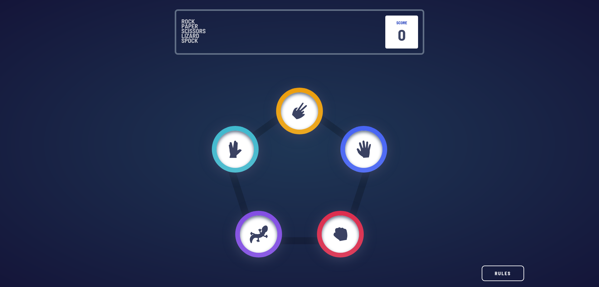
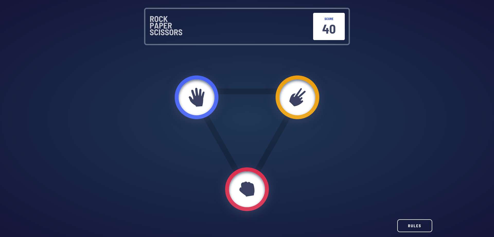
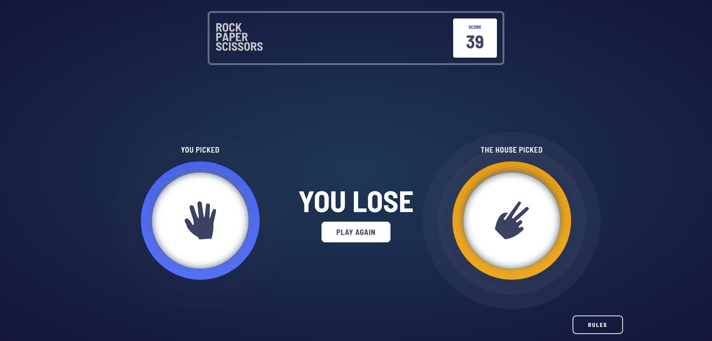
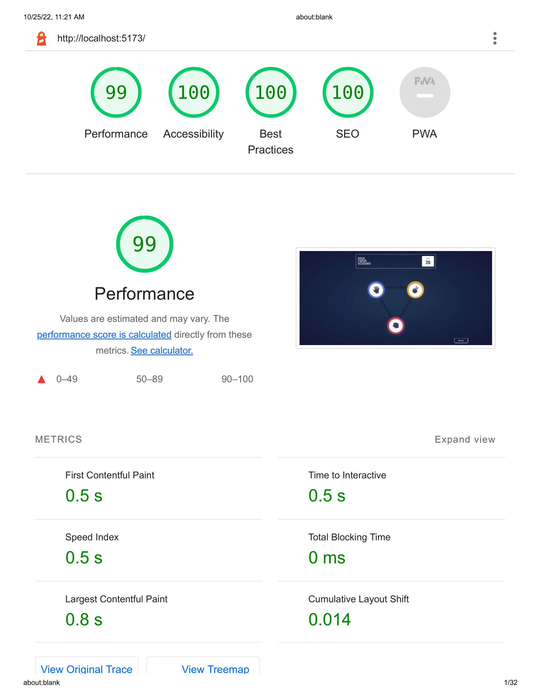

# Frontend Mentor - Rock, Paper, Scissors solution

This is a solution to the [Rock, Paper, Scissors challenge on Frontend Mentor](https://www.frontendmentor.io/challenges/rock-paper-scissors-game-pTgwgvgH). 

### The challenge

Users should be able to:

- View the optimal layout for the game depending on their device's screen size
- Play Rock, Paper, Scissors against the computer
- Maintain the state of the score after refreshing the browser _(optional)_
- **Bonus**: Play Rock, Paper, Scissors, Lizard, Spock against the computer _(optional)_

### Screenshots

*rock paper scissors lizard spock UI*
 
 
 

*rock paper scissors UI*
 
 
 

*game result*
 
 
 

## Description

Rock, Paper, Scissors is a classic game played between two players. As per [wikipedia](https://en.wikipedia.org/wiki/Rock_paper_scissors), Rock paper scissors (also known by other orderings of the three items, with "rock" sometimes being called "stone," or as Rochambeau, roshambo, or ro-sham-bo) is a hand game originating from China, usually played between two people, in which each player simultaneously forms one of three shapes with an outstretched hand. These shapes are "rock" (a closed fist), "paper" (a flat hand), and "scissors" (a fist with the index finger and middle finger extended, forming a V). "Scissors" is identical to the two-fingered V sign (also indicating "victory" or "peace") except that it is pointed horizontally instead of being held upright in the air.

A simultaneous, zero-sum game, it has three possible outcomes: a draw, a win or a loss. A player who decides to play rock will beat another player who has chosen scissors ("rock crushes scissors" or "breaks scissors" or sometimes "blunts scissors"), but will lose to one who has played paper ("paper covers rock"); a play of paper will lose to a play of scissors ("scissors cuts paper"). If both players choose the same shape, the game is tied and is usually immediately replayed to break the tie. The game spread from China while developing different variants in signs over time.

Rock paper scissors is often used as a fair choosing method between two people, similar to coin flipping, drawing straws, or throwing dice in order to settle a dispute or make an unbiased group decision. Unlike truly random selection methods, however, rock paper scissors can be played with a degree of skill by recognizing and exploiting non-random behavior in opponents.

## Game flow
1. When the user opens the game for the first time, the score is set to zero for both **original** and **bonus** variants.
2. Users can click on the *logo* to toggle between **original** and **bonus** game-modes.
3. **Original** game mode is selected by default.
4. Player selects a hand by clicking on the available options.
5. The house selects a hand at the same time..
6. As per FrontEnd Mentor design, the result of the game is updated step by step. 
7. A halo effect surrounds the winner of the round.
8. Game points are as follows:

    | Status | Points | Message    |
    | ------ | ------ | ---------- |
    | `Win`  | **+1** | *You win*  |
    | `Loss` | **-1** | *You lose* |
    | `Draw` | **0**  | *Draw*     |

9. Corresponding game rule can be expanded or collapsed by clicking on the **RULES** button.
10. This game uses the browser's localStorage to store the scores thus the scores are not transferred across browser.
11. This is primarily a front end app and is not connected to any database or external API.

## Tech Stack & resources

This web-app was created using the following: 
- Google Fonts CDN for external fonts
- HTML
- Vanilla CSS
- TypeScript compiled into JavaScript
- Git for version control
- Chrome Dev tools for debugging and style check
- Google lighthouse
- Vite as build-tool

*lighthouse score*
 
 
 

## Links

- Solution URL: [GitHub Repo](https://github.com/kanuos/rock-paper-scissors__vanilla)
- Live Site URL: [Github Pages](https://your-live-site-url.com)

## Author

- Website - [Sounak Mukherjee](https://www.sounakmukherjee.com)
- Frontend Mentor - [@kanuos](https://www.frontendmentor.io/profile/kanuos)
- GitHub - [@kanuos](https://www.github.com/kanuos)

